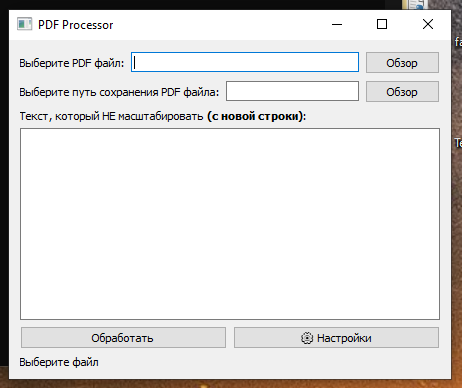
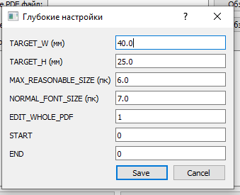
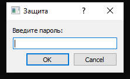
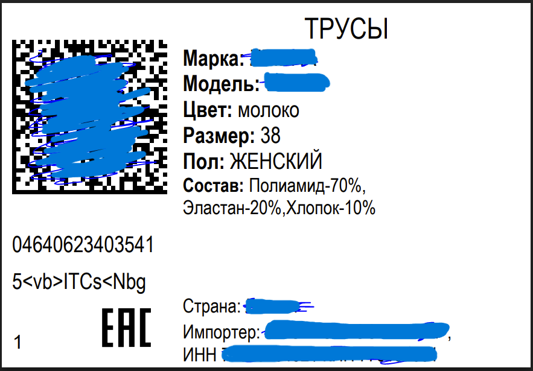
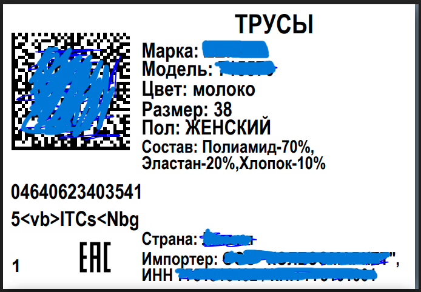

# 📦 Label Text Scaler & PDF Optimizer

**Label Text Scaler** — это утилита для автоматической предпечатной подготовки логистических бирок. Программа решает проблему мелкого и нечитаемого текста в PDF-файлах, делая их пригодными для качественной печати на термопринтерах.

---

## 📌 Проблема

Клиенты часто присылают PDF-файлы с бирками, где текст слишком мелкий. При печати (особенно на термопринтерах с низким DPI) он становится нечитаемым:

- ❌ адреса расплываются
- ❌ штрихкоды сложно сканировать
- ❌ повышается риск ошибок доставки

---

## ✨ Решение

Программа автоматизирует процесс переработки PDF-документов:

1. **PDF → HTML:** Конвертация файла в редактируемый формат через API CloudConvert
2. **Анализ структуры:** Поиск текстовых элементов
3. **Smart Font Scaling:** Пропорциональное увеличение текста
4. **Оптимизация макета:** Подгонка под нужный размер
5. **Экспорт:** Готовый PDF-файл для печати

---

## 🚀 Основные функции

- ✅ Автоматическое увеличение текста
- ✅ Поддержка различных размеров этикеток (10×15 см, 58×40 мм и др.)
- ✅ Сохранение структуры документа
- ✅ Пакетная обработка файлов
- ✅ Интеграция с CloudConvert API

---

## ⚙️ Расширенные настройки

Добавлено отдельное окно **глубоких настроек**, где можно:

- 📏 Масштабировать документ под нужный размер
- 📄 Обрабатывать только выбранный диапазон страниц
- 🔠 Настраивать коэффициент увеличения текста
- 🖼 Добавлять или заменять логотип в документе
- 🌐 Выбирать браузер (адаптация под систему пользователя)

---

## 💾 Работа с настройками

- ⚡ Все настройки сохраняются автоматически
- 🔄 Есть кнопка **«Сбросить настройки»** для возврата к значениям по умолчанию

---

## 🔑 Требования

Для работы потребуется:

- API-ключ CloudConvert
- Python 3.x (для сборки/разработки)

---

## 🛠 Технологии

- **Python 3.x**
- **CloudConvert API** (конвертация PDF → HTML)
- **Playwright** (работа с браузером)
- **PyInstaller** (сборка приложения)

---

## ⚙️ Установка и сборка

### 1. Клонирование репозитория

```bash
git clone https://github.com/TimurPhys/PdfFormatter.git
cd PdfFormatter
```

---

### 2. Создание виртуального окружения

**Windows:**

```bash
py -m venv .venv
.venv/Scripts/Activate.ps1
```

**Linux / macOS:**

```bash
python3 -m venv .venv
source .venv/bin/activate
```

Установка зависимостей:

```bash
pip install -r requirements.txt
```

---

### 3. Сборка проекта

```bash
pyinstaller --no-console --onedir --name "PdfFormatter" --collect-all playwright app/app.py
```

> ⚠️ Флаг `--no-console` можно убрать, если нужен вывод в консоль

---

### 4. Готовый билд

Собранный проект будет находиться в папке:

```
dist/
```

---

### 5. Финальная настройка

- Переместите папку `dist` в нужное место
- Убедитесь, что рядом есть папка `icons`
- Укажите путь к `icons` в настройках программы

---

### 6. Готово 🎉

Программа полностью готова к использованию!

---

## 🔐 Защита доступа

- Вход в программу защищён паролем
- Пароль хранится в виде хэша в файле `protection.py`
- При изменении пароля необходимо заменить хэш

---

## 🖼 Интерфейс программы

### Главное окно



### Окно настроек



### Окно ввода пароля



---

## 📊 Результаты работы

### До обработки (Детали были закрашены в целях конфиденциальности)



### После обработки



---

## 📌 Итог

**Label Text Scaler** значительно упрощает работу с логистическими PDF-файлами:

- ⏱ Экономит часы ручной работы
- 📈 Повышает читаемость и качество печати
- 🤖 Полностью автоматизирует процесс
